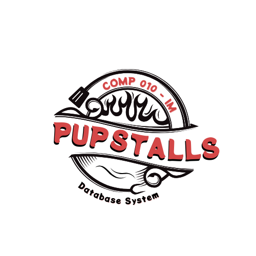

<a id="readme-top"></a>

<div align="center">
  <a href="https://github.com/krislette/pup-stalls">
    
  </a>

  <h1 align="center">PUPStols</h1>
  <p align="center">
    Manage Stalls With Ease
    <br />
    <a href="#database-design"><strong>Explore the design »</strong></a>
    <br />
    <br />
    <a href="#demo">View Demo</a>
    ·
    <a href="https://github.com/krislette/jeepney-navigation/issues">Report Bug</a>
    ·
    <a href="https://github.com/krislette/jeepney-navigation/issues">Request Feature</a>
  </p>
</div>

<!-- <div align="center">
  
</div> -->

## About The Project

> This project aims to connect MariaDB with Node.js 
> to build a web application for PUP stall owners. 
> MariaDB will manage data storage, while Node.js will handle 
> the server-side operations.

### Table Of Contents
<ol>
  <li>
    <a href="#about-the-project">About The Project</a>
    <ul>
      <li><a href="#table-of-contents">Table Of Contents</a></li>
      <li><a href="#features">Features</a></li>
      <li><a href="#technologies-used">Technologies Used</a></li>
    </ul>
  </li>
  <li>
    <a href="#database-design">Database Design</a>
  </li>
  <li>
    <a href="#application-snapshots">Website Snapshots</a>
  </li>
  <li>
    <a href="#folder-structure">Folder Structure</a>
  </li>
  <li>
    <a href="#installation">Getting Started</a>
    <ul>
      <li><a href="#prerequisites">Prerequisites</a></li>
    </ul>
  </li>
  <li>
    <a href="#license">License</a>
  </li>
</ol> 

### Features
- Authentication System
- Log in and log out function
- Dashboard
- PUP Lagoon Carousel
- Profile
- Sign Up
- Inventory Management
- Finance Management
- Transaction Management
- Rent History Tracking

### Technologies Used

PUPStols uses a number of open source projects to work properly:

- [React](https://react.dev/): A JavaScript library for building user interfaces, maintained by Facebook.
- [Node.js](https://nodejs.org/en): A JavaScript runtime built on Chrome's V8 JavaScript engine, used for server-side scripting.
- [Express](https://expressjs.com/): A fast, unopinionated, minimalist web framework for Node.js.
- [MariaDB](https://mariadb.org/): An open-source relational database management system, compatible with MySQL.
- [bcrypt](https://www.npmjs.com/package/bcrypt): A library to help hash passwords.
- [jsonwebtoken](https://www.npmjs.com/package/jsonwebtoken): An implementation of JSON Web Tokens (JWT) for authentication.

## Database Design
Database design plays a very important part in the Software Development Life Cycle (SDLC). This part includes creating metadata, normalization, and constructing an Entity-Relationship Diagram (ERD).

- [PUPStols Metadata](https://drive.google.com/file/d/1UBAPrvSfFIW2WUNqS5b-kiP3ZzwysLKH/view?usp=sharing)

- [PUPStols Normalization](https://docs.google.com/spreadsheets/d/1WO5OKFjlz0yTrVRhVDeLzsTTGsUBFzDk/edit?usp=drive_link&ouid=110674875045139190778&rtpof=true&sd=true)

- [PUPStols ERD](https://drive.google.com/file/d/1bBlRUzZ9ulnMjQjbUQo2Ej92lAeqAjNu/view?usp=drive_link)

To add, provided [here](https://drive.google.com/file/d/1P2I2Az3IUgq-aQCmdNX28bRDJkf_ARUN/view?usp=drive_link) is the `.sql` file of `dbStalls` (the database used) if you want to have the database ready with dummy data.

## Website Snapshots

### Log in page


### Sign up page


### Home page


### CRUD page example


### Read-only page


### Profile page


## Folder Structure

    .
    ├── client                  # Client-side folder
    │ ├──── node_modules        # React Packages
    │ ├──── public              # Auto-generated react files
    │ └──── src                 # Source files
    ├── server                  # Server-side folder
    │ ├──── config              # Database connection
    │ ├──── controllers         # Controllers 
    │ ├──── middlewares         # Middlewares
    │ ├──── models              # Models
    │ ├──── node_modules        # Node Packages
    │ └──── routers             # Endpoints
    └── README.md


## Getting Started
PUPStols is not yet accessible to the world wide web, as it is yet to be deployed. But, if you're interested in seeing the UI and experience the website yourself, you are in the right section of the README. To get started with accessing the source code, follow the steps below.

### Prequisites

- Ensure that Node.js and npm are installed on your machine.

<details>
<summary><b>Show Instructions</b></summary>

1. You can fork this repository, or you can also clone this repository directly on your local machine.

2. After cloning the repository on your local machine, access it on any IDE.

    > After opening the project, you should see all the files listed on 
    > the [Folder Structure](#Folder-Structure), but without the `.env` for the server-side code.

3. Install dependencies using,

    ```bash
    npm install
    ```

3. Create a .env on the server folder and type the code below. Make sure to replace `YOUR_DB_PASSWORD_HERE` with your actual **MariaDB/MySQL/Any RDBMS password**.

    ```bash
    DATABASE_PASSWORD="YOUR_DB_PASSWORD_HERE"
    ```

3. Configure the database connection in `server/config/db.js` as per your MariaDB/MySQL/Any RDBMS database environment.

4. To install the required dependencies for the **client** folder, see [`package.json`](https://github.com/krislette/pup-stalls/blob/main/client/package.json)

5. To install the required dependencies for the **server** folder, see [`package.json`](https://github.com/krislette/pup-stalls/blob/main/server/package.json)


4. Run the server on `/server`.

    ```bash
    node server.js
    ```

5. With nodemon, you can run the server using,

    ```bash
    npm run server
    ```

6. Run the client on `/client`.

    ```bash
    npm start
    ```

</details>

## License
Distributed under the [MIT](https://choosealicense.com/licenses/mit/) License. See [LICENSE](LICENSE) for more information.

<p align="right">[<a href="#readme-top">Back to top</a>]</p>